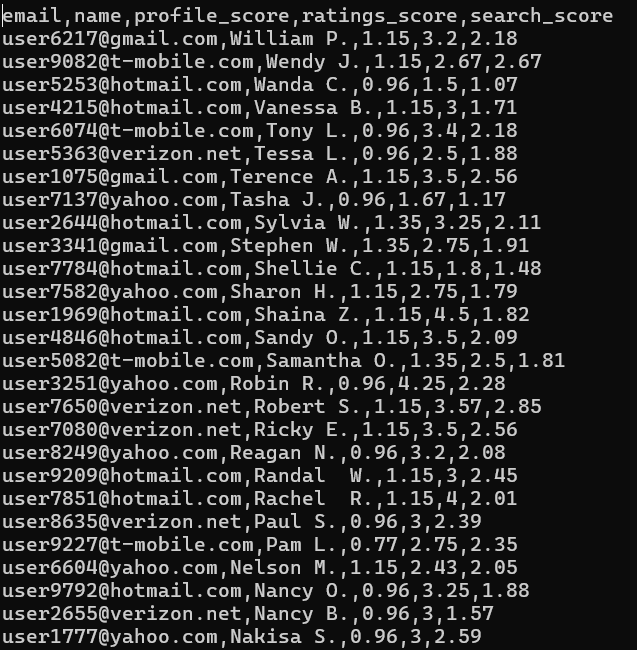

# Search Engine

---
**Solution contains from the next projects**:
<ol>
  <li>ScoreEngine.Start</li>
  <li>ScoreEngine.Repositories (Data Source)</li>
  <li>ScoreEngine.Init (Configuration, IoC/DI)</li>
  <li>ScoreEngine.Domain (Domain Models)</li>
  <li>ScoreEngine.Contracts (Interfaces, Contracts)</li>
  <li>ScoreEngine.Busness(Implementation of busness logic)</li>
</ol> 

---

---

**How to run on MacOs**

- [x]. Clone source

  ``git clone https://github.com/abaksheiev/search-engine.git``
 
- [x] Go inside of project folder
  
  ``cd  search-engine``

- [x] Build docker image with SDK, this give ot aboid insta;; .net .net sdk
  
  ``docker build -t search-engine:v1 .``

- [x] Run container

    ``docker run -d --name search-engine search-engine:v1``

- [x] Go inside running container

    ``docker run --rm -it --user root search-engine:v1 bash``

    

- [x] Folder Data contains test csv file with test data

    

- [x] Run Console app

    ``./ScoreEngine.Start``

- [x] In Data folder will be created file sitters.csv

    
