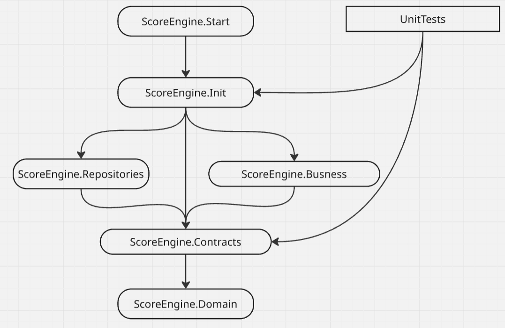
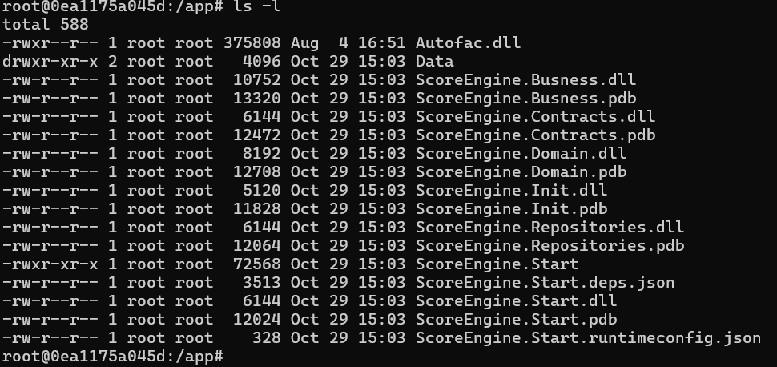
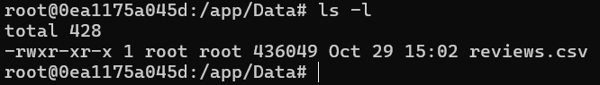
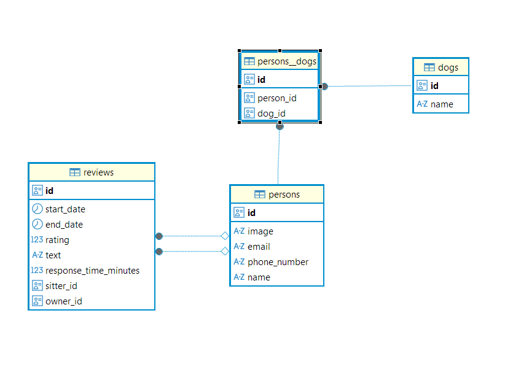

# Search Engine
## Discussion Question
#### How would you adjust the calculation and storage of search scores in a production application?

From perspective calculation i dont expect heavy problem, as it seems that calculation is simple, but amount of them are huge. It would be better to have 2 options 
to push calculation regular one and manual by request.
- Regular :
> Would needed to create event message system, all new data(reviews) after coming in system push(Publisher) a event in queue for calculation. Cron job(Consumer) take message and procced all calculation. 
Calculations are procced in containers with horisontall scalling. Running all calculations could be done in low loading system time(for ex. at night)
- Manual by request: 
> User could make request to update their scores and score must be updated immediatly, but system must have limitation for interval in order to abvoi spam requests. Also could be done via message Publisher/Consumer.

Storing data in relatain database, as it is needed relation with user.

For such UI like grid which required data from many tables and quering data cold be bottlneck i would use redis or elasticsearch databases. Which should be update each time when calculationis finish(only for those records which were updated)

---
## Solution contains from the next projects:
<ol>
  <li>ScoreEngine.Start</li>
  <li>ScoreEngine.Repositories (Data Source)</li>
  <li>ScoreEngine.Init (Configuration, IoC/DI)</li>
  <li>ScoreEngine.Domain (Domain Models)</li>
  <li>ScoreEngine.Contracts (Interfaces, Contracts)</li>
  <li>ScoreEngine.Busness(Implementation of busness logic)</li>
</ol> 

---

---

## How to run on MacOS

- [x] Clone source

  ``git clone https://github.com/abaksheiev/search-engine.git``
 
- [x] Go inside of project folder
  
  ``cd  search-engine``

- [x] Build docker image with SDK, this give ot aboid insta;; .net .net sdk
  
  ``docker build -t search-engine:v1 .``

- [x] Run container

    ``docker run -d --name search-engine search-engine:v1``

- [x] Go inside running container

    ``docker run --rm -it --user root search-engine:v1 bash``

    

- [x] Folder Data contains test csv file with test data

    

- [x] Run Console app

    ``./ScoreEngine.Start``

- [x] In Data folder will be created file sitters.csv

- [x] Recommended database scheme

